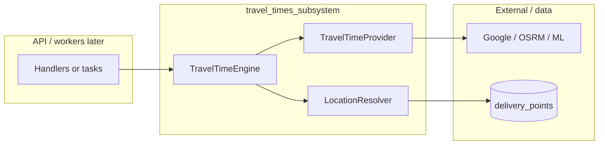

# Travel time subsystem — architecture

This document explains **how the travel-time pieces fit together** in code and how that maps to common industry patterns. Use it when you implement a new story (A3, A4, …) or onboard someone who has not built this style of system before.

---

## Where the code lives

| Path | Role |
|------|------|
| `app/travel_times_subsystem/schemas.py` | **Contracts** (Story A1): Pydantic models — `TravelTimeRequest`, `TravelTimeResult`, `LatLng`, `DeliveryPointRef`, legs, errors. |
| `app/travel_times_subsystem/providers.py` | **Provider interface** (Story A2): `TravelTimeProvider` (ABC), `TravelTimeProviderError`. |
| `app/travel_times_subsystem/resolvers.py` | **Location resolution** (Story A2): `LocationResolver` (ABC), `LocationResolutionError`, `DbLocationResolver`. |
| `app/travel_times_subsystem/engine.py` | **Orchestration** (Story A2): `TravelTimeEngine`, `EngineStrategy`. |

API routes and Celery tasks (later) should depend on **`TravelTimeEngine`**, not on a concrete Google class or the database session directly for resolution.

---

## Layers (who talks to whom)

1. **Handler** builds a `TravelTimeRequest` (may include `DeliveryPointRef`).
2. **Engine** resolves refs → `LatLng` via `LocationResolver`, then calls one or more **providers** according to **strategy**.
3. **Provider** maps request → external API → `TravelTimeResult`.

---

## Design patterns (names you will see in books and blogs)

| Pattern | Where in where2now | Why it helps |
|--------|---------------------|--------------|
| **Strategy** | `EngineStrategy` + `TravelTimeEngine` | Swap “call one provider” vs “try chain” without changing handler code. |
| **Abstract factory / plug-in** | `TravelTimeProvider` ABC | New sources (Google, OSRM, ML) are new classes; engine stays the same. |
| **Adapter** | Each concrete provider | Adapts Google’s JSON (or OSRM’s) to our `TravelTimeResult`. |
| **Repository-style port** | `LocationResolver` | Engine does not import SQLAlchemy models; tests use in-memory stubs. |

This is the same idea as **hexagonal / ports-and-adapters**: the **domain contract** is in the center; I/O (HTTP, DB) sits behind interfaces.

---

## Types of “things” (mental model)

| Kind | Examples | Typical base |
|------|----------|--------------|
| **Data transfer / validation** | `TravelTimeRequest`, `TravelTimeLeg` | Pydantic `BaseModel` — good for JSON and clear errors. |
| **Behavior + polymorphism** | `TravelTimeProvider`, `LocationResolver` | ABC with `@abstractmethod` — forces subclasses to implement. |
| **Enums** | `EngineStrategy`, `TransportMode` | `str, Enum` — stable string values in APIs and logs. |
| **Failures** | `TravelTimeProviderError`, `LocationResolutionError` | `Exception` subclasses with fields — callers can branch or log. |

---

## Exceptions vs errors in `TravelTimeResult`

Rough rule (aligned with the roadmap):

- **`TravelTimeProviderError`** — *Unrecoverable* for this call from this provider (auth, repeated 5xx, total timeout). The **engine** may catch it and fall back or turn it into an engine-level `TravelTimeResult.errors` entry.
- **Leg `error` + global `TravelTimeError`** — *Expected* partial failure (no route for one OD pair, unsupported mode for one leg). Return a normal `TravelTimeResult` with populated `errors` / leg `error`.

---

## Testing strategy

- **Unit tests**: fake `TravelTimeProvider` and in-memory or dict `LocationResolver`; assert engine behavior (resolution, strategy, fallback).
- **Provider tests**: mock HTTP (e.g. `httpx` / responses); never call real Google in CI.
- **Integration tests** (optional later): real DB + `DbLocationResolver` with test fixtures.

---

## Open-source alternatives (context)

- **Geocoding** (address → coordinates): we already use **Nominatim** / OSM-style APIs in `app/geocoding/`.
- **Travel times** (coordinates → duration/distance): common self-hosted options are **OSRM**, **Valhalla**, **GraphHopper**. Each would be a new `TravelTimeProvider` implementation; the engine does not change.

---

## Further reading

- Per-story checklists and class-level detail: [`docs/stories/`](../stories/README.md)
- Product epic list and order: [`docs/roadmap.md`](../roadmap.md)
